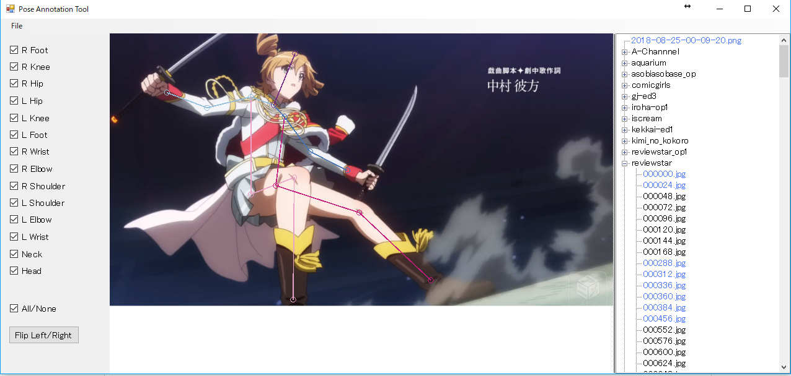

# PoseAnnotationTool

A simple 2D keypoint annotation tool



## How to run

1. Locate your images as following.

```
images
├ folderA
   ├ imageA.jpg
   ├ imageB.jpg
   ├ ...
├ folderB
   ├ imageX.jpg
   ├ imageY.jpg
   ├ ...
├ ...
```

2. Replace "DefaultDataDir" in Datasets.cs with your image folder.

3. Then, build and run (We confirmed it works in Visual Studio 2019)